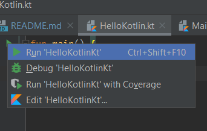

# Kotlin Course - Tutorial for Beginners

This is my work on this good Kotlin tutorial. 
https://www.youtube.com/watch?v=F9UC9DY-vIU  
I am doing this for training purposes and 
will keep every chapter in separate file. 

## Can't find Run triangle after clone the project? 
   
 The reason is that .iml file is ignored inside 
 .gitignore file. You need to click on src 
 directory with the right button on the mouse 
 and choose "Mark Directory as Source root".
 After that you will be able to run every example. 
 